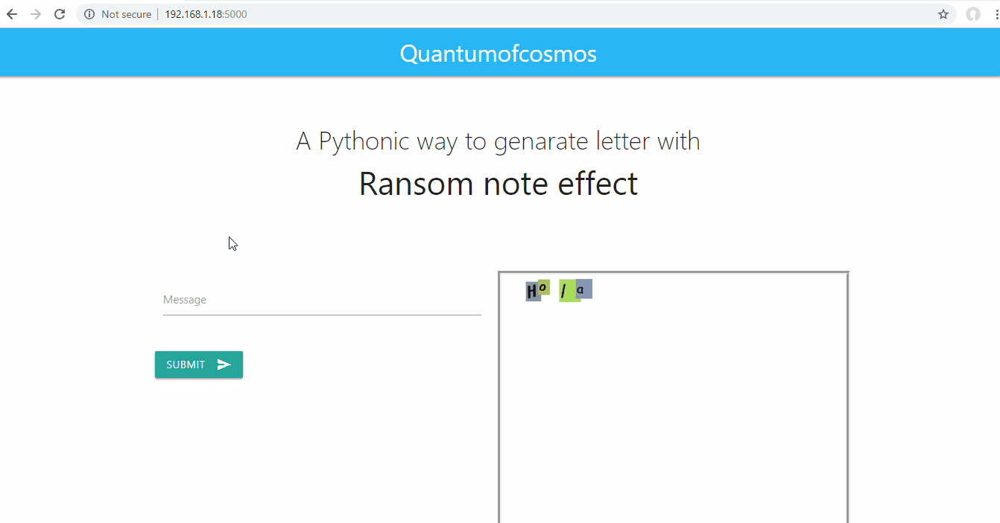

# Ransom Note Generator

Application written in python to make a note look like it is cut from a newspaper.

## Demo:

## Stack:
* Pillow for image creation and text arrangement
* Flask for serving it as a web application
* Materializecss for web app front end

## Features Available
* Randomized
  * Background color
  * Font size(Between 22 and 32)
  * Alphabet rotation
  * Font styles(selection between Comic, Comic Bold, FreeSans, Times New Roman, Trebuchet Bold, Vera MoBI and Verdana Italic, Can be extended to more fonts)

## Features ToDo
* Add a download image button(can be downloaded with right click menu as of now)
* Extensible font styles
* Play with alphabet case
* Word wrapping(Current line break is based on the space available on page not based on the word being processed)
* Take user inputs to randomize above features.
* (May be) Live loading of image(Currently reloads after you submit)
* (May be) randomize font color which is currently fixed to black.
****
## How to run this locally
**Requirements:**  Python should be installed in your local machine
**Steps to run:**
* Clone this git repository to your local file system.
* Open terminal inside the project folder.
* run command `pip install requirements.txt`
* After the requirements are installed run `python server.py`
* The application can be accessed via any web browser in your system at *http://127.0.0.1:5000/*
